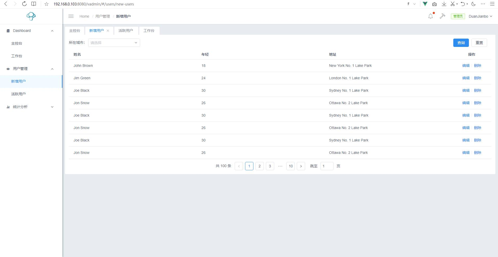

# vadmin

> 基于 Vue 3 + Vite + Pinia + View UI Plus 的真实多 tab 页轻量 Admin 后台。
> 该项目是轻量、示例型的；仅包含基本的交互和必须的逻辑代码，其他如菜单、权限控制、数据交互可自由扩展。
> 一些自动化的工作需要遵循一定的开发约定，参照示例页面即可。

## Tech Stack 技术栈

- Vue 3 + `<script setup>` + TypeScript
- Vite 6 构建
- Pinia 状态管理
- Vue Router 4
- View UI Plus（iView Vue 3 版本）

## Snapshots 截图



## Preview Online 在线预览

visit [https://duanjianbo.github.io/vadmin](https://duanjianbo.github.io/vadmin)

## Requirements 环境要求

- Node.js >= 20.19（推荐 22 LTS，仓库已提供 `.nvmrc`）
- 包管理器任选 npm / pnpm / yarn

## Project setup 安装

```
yarn install
```

### Compiles and hot-reloads for development 本地开发

```
yarn dev
```

### Compiles and minifies for production 打包生产

```
yarn build
```

> 如果想去除部署 url 的 `vadmin` 子目录，在 `vite.config.ts` 中将 `base` 改为 `'/'` 即可。

### Compiles for preview environment 打包测试环境（使用 .env.preview）

```
yarn preview
```

### Preview production build locally 本地预览构建产物

```
yarn preview:serve
```

## Contact

mail: jianbo.duan@foxmail.com
