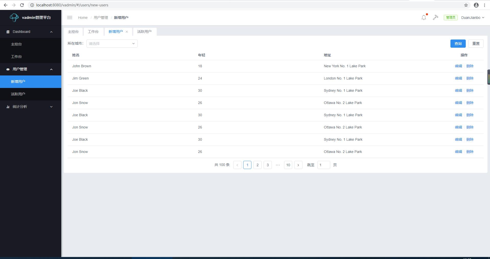

# vadmin
> 基于vue、iview的真实多tab页的轻量Admin后台。  
> 该项目是轻量的、示例型的；仅包含基本的交互和必须的逻辑代码，其他如菜单、权限控制、数据交互实现因人而异，可自由修改。  
> 一些自动化的工作需要遵循一定的开发约定，因代码轻量且简单，参照示例页面即可。

## Snapshots 截图


## Preview Online 在线预览
visit [https://duanjianbo.github.io/vadmin](https://duanjianbo.github.io/vadmin)

## Project setup 安装
```
yarn install
```

### Compiles and hot-reloads for development 本地开发Serve
```
yarn serve
```

### Compiles and minifies for production 打包生产
```
yarn build
```
> if you want to access it through a url that doesn't contain 'vadmin',you can remove it. see: `vue.config.js`  publicPath: '/vadmin'.  
如果想去除部署url的vadmin子目录，在vue.config.js中删除它即可。

### Compiles and minifies for preview 打包测试环境 使用.env.preview变量
```
yarn preview
```

### Lints and fixes files
```
yarn lint
```

### Customize configuration
See [Configuration Reference](https://cli.vuejs.org/config/).
